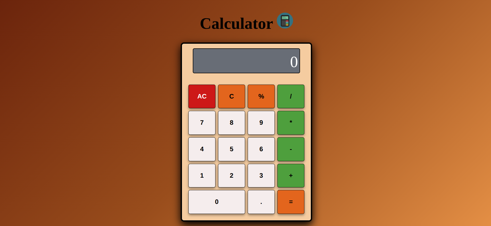

# Calculator

A modern, responsive calculator built with HTML, CSS, and JavaScript. This calculator supports basic arithmetic operations, negative numbers, and percentage calculations.

## Features

- Basic arithmetic operations (addition, subtraction, multiplication, division)
- Support for negative numbers
- Percentage calculations
- Error handling for invalid operations
- Responsive design
- Scientific notation for large numbers
- Clear and intuitive user interface

## Screenshot



## Installation

1. Clone this repository:

```bash
git clone https://github.com/ReMoOuZz/calculator.git
```

2. Navigate to the project directory:

```bash
cd calculator
```

3. Open `index.html` in your web browser

## Usage

- Use number buttons (0-9) to input numbers
- Use operator buttons (+, -, \*, /) for calculations
- Press "=" to see the result
- Use "AC" to clear all
- Use "C" to delete the last digit
- Use "%" for percentage calculations
- Use "-" to input negative numbers
- Use numerical input to use the calculator

## Technologies Used

- HTML5: Structure and layout
- CSS3: Styling and responsive design
- JavaScript: Core functionality and calculations

## Features in Detail

- **Negative Numbers**: Support for starting calculations with negative numbers
- **Percentage**: Calculate percentages of numbers
- **Error Handling**: Clear error messages for invalid operations
- **Number Formatting**: Automatic formatting for large numbers using scientific notation
- **Responsive Design**: Works on all screen sizes
- **State Management**: Proper handling of calculation states and operator precedence
